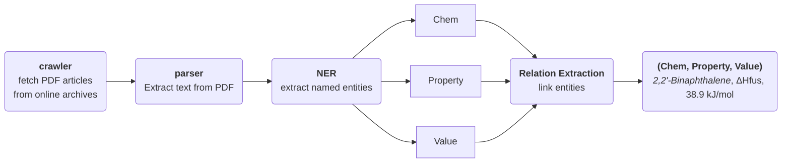

# CPREx - Chemical Properties Relation Extraction

CPREx is an end to end tool for Named Entity Recognition (NER) and Relation Extraction (RE) specifically designed for chemical compounds and their properties. The goal of the tool is to identify, extract and link chemical compounds and their properties from scientific literature. For ease of use, CPREx provides a custom [spacy](https://spacy.io/) pipeline to perform NER and RE.

The pipeline performs the following steps

