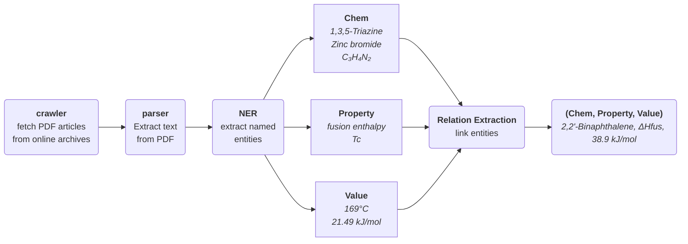

# CPREx - Chemical Properties Relation Extraction

[](LICENSE)


CPREx is an end to end tool for Named Entity Recognition (NER) and Relation Extraction (RE) specifically designed for chemical compounds and their properties. The goal of the tool is to identify, extract and link chemical compounds and their properties from scientific literature. For ease of use, CPREx provides a custom [spaCy](https://spacy.io/) pipeline to perform NER and RE.

The pipeline performs the following steps



## Installation

CPREx works with a recent version of python (**>=python 3.11**). Make sure to install CPREx in a virtual environment of your choice.

CPREx depends on [GROBID](https://github.com/kermitt2/grobid) and its extension [grobid-quantities](https://github.com/lfoppiano/grobid-quantities) for parsing PDF documents and extracting quantities from their text. In order to install and run GROBID, a JDK must also be installed on your machine. [GROBID currently supports](https://grobid.readthedocs.io/en/latest/Install-Grobid/) JDKs from **1.11 to 1.17**.

### Install via PyPI

You can install CPREx directly with pip:

```console
pip install cprex
```

### Install from github

This installation is recommended for users who want to customize the pipeline or train some models on their own dataset.

Clone the repository and install the project in your python environment, either using `pip`

```console
git clone git@github.com:jonasrenault/cprex.git
cd cprex
pip install --editable .
```

or [poetry](https://python-poetry.org/)

```console
git clone git@github.com:jonasrenault/cprex.git
cd cprex
poetry install
```

### Install grobid and models

#### Installing and running grobid

CPREx depends on [GROBID](https://github.com/kermitt2/grobid) and its extension [grobid-quantities](https://github.com/lfoppiano/grobid-quantities) for parsing PDF documents and extracting quantities from their text. For convenience, CPREx provides a command line interface (CLI) to install grobid and start a grobid server.

Run

```console
cprex install-grobid
```

to install a grobid server and the grobid-quantities extension (by default, grobid and models required by CPREx are installed in a `.cprex` directory in your home directory).

Run

```console
cprex start-grobid
```

to start a grobid server and enable parsing of PDF documents from CPREx.

#### Installing NER et REL models

To perform Named Entity Recognition (NER) of chemical compounds and Relation Extraction (RE), CPREx requires some pretrained models. These models can be installed by running

```console
cprex install-models
```

This will install a [PubmedBert model](https://ftp.ncbi.nlm.nih.gov/pub/lu/BC7-NLM-Chem-track/) finetuned on the NLM-CHEM corpus for extraction of chemical named entities. This model was finetuned by the [BioCreative VII track](https://biocreative.bioinformatics.udel.edu/tasks/biocreative-vii/track-2/).

It will also install a [RE model](https://github.com/jonasrenault/cprex/releases/tag/v0.4.0) pre-trained on our own annotated dataset.

#### Installing a base spacy model

A base [spaCy model](https://github.com/explosion/spacy-models/releases), such as `en_core_web_sm`, is required for tokenization, lemmatization, and all other features offered by spaCy. To install a spaCy model, you can run

```console
python -m spacy download en_core_web_sm
```

or directly install it with pip by specifying the model's url

```console
pip install https://github.com/explosion/spacy-models/releases/download/en_core_web_sm-3.7.1/en_core_web_sm-3.7.1.tar.gz
```

## Run CPREx

### Using Docker

The easiest way to run CPREx is to use [Docker](https://docs.docker.com/) to start a container running CPREx. Refer to the [official documentation](https://docs.docker.com/get-docker/) for instructions on how to install Docker on your system.

You can then pull the CPREx image from github's container registry with

```console
docker pull ghcr.io/jonasrenault/cprex:latest
```

You can start a container running this image with

```console
docker run -t --rm -p 80:8501 ghcr.io/jonasrenault/cprex:latest
```

Note that the image is only compiled for amd64 architectures. Add `--platform=linux/amd64` if running on an ARM architecture.

Once the container is started, you can access CPREx's streamlit UI by opening a browser at the [http://localhost](http://localhost) URL.

### Run streamlit locally

CPREx provides a User Interface built with [streamlit](https://streamlit.io/). The UI lets you upload a PDF file and see the results of running CPREx on it. If you've cloned the CPREx repository locally and installed the projet in a python environment, you can run the UI by executing the following command, in the python environment and from CPREx's root directory

```console
streamlit run cprex/ui/streamlit.py
```

This will start a web server exposing the UI at [http://localhost:8501](http://localhost:8501). Note that for CPREx's pipeline to work, you must have installed the models with the `cprex install-models` command, and started the grobid services with `cprex start-grobid`.

### Notebook examples

Notebook examples showing how to use CPREx directly in a Python script are available in the [notebooks](./notebooks/) directory. To run the notebooks, install [jupyterlab](https://jupyter.org/install) in your Python environment, start it with `jupyter lab`, and open one of the example notebooks. Note that for CPREx's pipeline to work, you must have installed the models with the `cprex install-models` command, and started the grobid services with `cprex start-grobid`.
